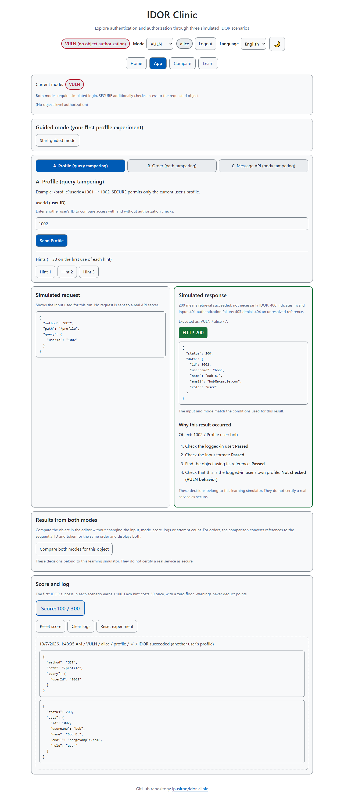
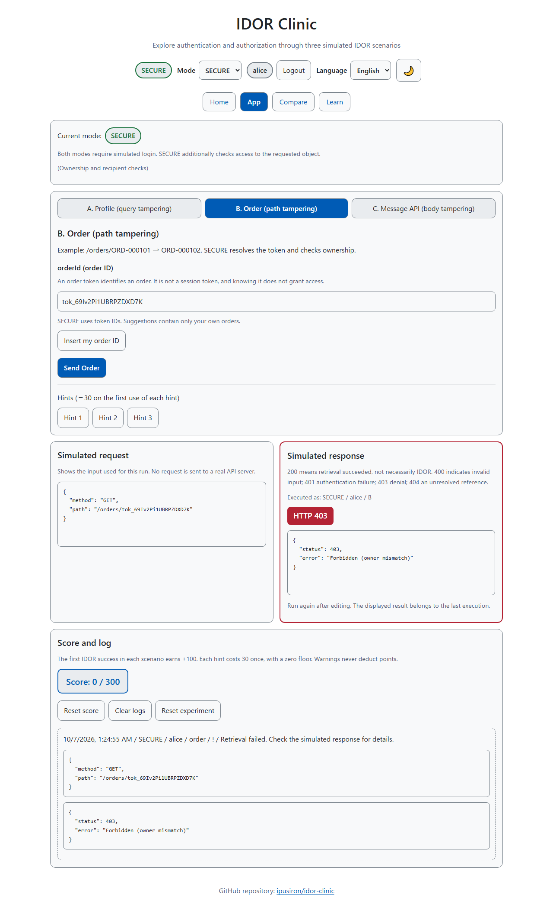
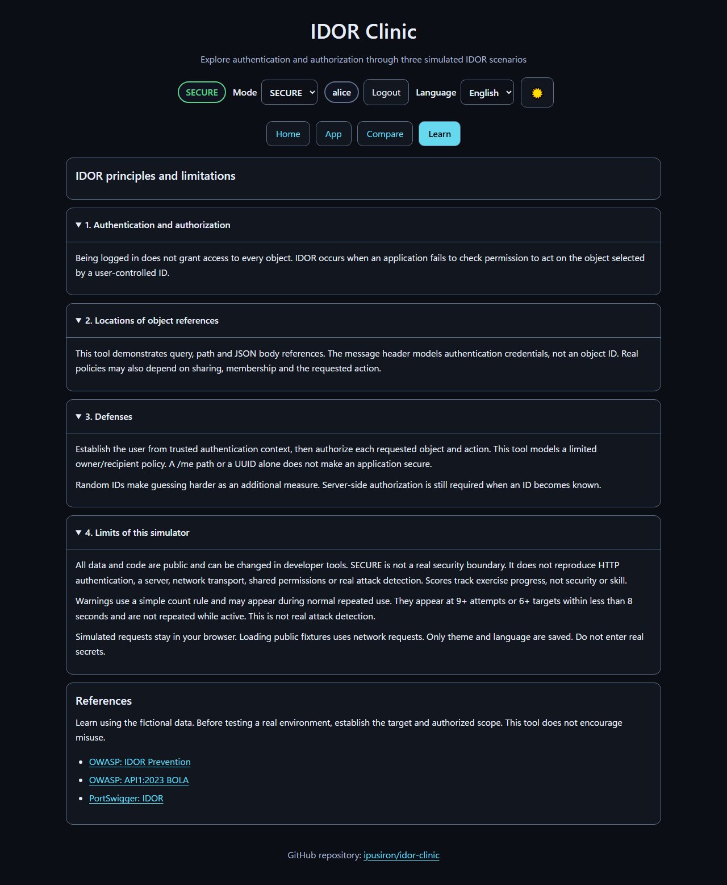

English · [日本語](README.md)
# IDOR Clinic - Interactive IDOR Learning Simulator


[](https://ipusiron.github.io/idor-clinic/)

**Day065 - 100 Security Tools with Generative AI**

IDOR Clinic is a browser-only simulator for learning about IDOR: missing authorization checks when a user changes an object ID.
Use fictional profiles, orders and messages to compare VULN (no object authorization) with SECURE (object authorization).

SECURE is a teaching model, not a real access-control boundary.
Random IDs make guessing harder as an additional measure; they do not replace authorization for each object.

---

## 🌐 Live demo

[Open IDOR Clinic](https://ipusiron.github.io/idor-clinic/?lang=en)

No installation is needed.
Language selection follows this priority: the URL's `?lang=ja|en`, a saved preference, then the browser language.
Non-Japanese browser languages use English.

## 📸 Screenshots



*English, light theme. Alice retrieves Bob's profile.*



*English, light theme. Knowing a valid order token still results in 403 when the owner differs.*



*English, dark theme. The learning page.*

## 🎯 Learning goals

- Distinguish login-based authentication from authorization for an action on an object
- Identify object references in queries, paths and JSON bodies
- Distinguish random identifiers from ownership checks
- Compare normal retrieval, authentication failures, authorization failures and unresolved references

This model allows only the current user's profile, their own orders and messages addressed to them.
Real services need policies that also account for sharing, membership and the requested action.
The header's session token models authentication credentials; it is not an object ID.

## 🚀 Quick start

1. Select VULN and log in as the simulated user `alice (#1001)`
2. Open App and choose scenario A
3. Enter `1002` as `userId` and select Send Profile
4. Observe Bob's data returned with status 200
5. Switch to SECURE and run the same input again to observe 403

Changing modes preserves inputs and the last result.
The displayed result belongs to the last execution: check its recorded mode and user, and run again to compare modes.

## 🧪 Three scenarios

### A. Profile query tampering

Change the object ID in `GET /profile?userId=1002`.
VULN returns profiles to other logged-in users; SECURE compares the requested ID with the current user's ID.
Retrieving your own data with status 200 is not an IDOR success.

### B. Order path tampering

VULN uses sequential IDs such as `ORD-000101`.
SECURE uses `tok_...` order tokens generated at startup as references, then checks ownership after resolving the reference.
Insert my order ID fills in one of your order IDs for the current mode.

A known valid token for another user's order still returns 403.
To try this, log in as Bob in SECURE, note one of his order IDs, then log out and log in as Alice without reloading the page and enter that ID.
Order tokens identify orders; they are separate from the session token, which changes on each login.

### C. Message JSON body tampering

Enter `{"messageId":9002}` as the body of `POST /api/messages/view`.
The body must be an object containing only `messageId`, with a positive safe integer value.
`null`, arrays, string IDs, extra keys and malformed JSON return 400.

SECURE checks the current `X-Access-Token` and the recipient.
Header names are case-insensitive.
The header must be a single line; limits are 4,096 characters for the body, 256 for the header and 128 for an order ID.

### Example responses

This table assumes Alice (1001) is logged in.
For C, “valid token” means the current session token.

| Operation | VULN | SECURE |
|---|---|---|
| A: Own profile, 1001 | 200 | 200 |
| A: Another user's profile, 1002 | 200 | 403 |
| B: Own sequential ID, ORD-000101 | 200 | 404 |
| B: Another user's sequential ID, ORD-000102 | 200 | 404 |
| B: Own valid order token | 404 | 200 |
| B: Another user's valid order token | 404 | 403 |
| C: Own message, 9001, valid token | 200 | 200 |
| C: Another recipient's message, 9002, valid token | 200 | 403 |
| C: Own message, 9001, no token | 200 | 401 |
| C: Invalid body | 400 | 400 |

Both modes require simulated login. Calling a simulated API without a logged-in user returns 401.
A 404 means the reference was not resolved; it does not prove correct authorization or an unguessable ID.

## ⚖️ Mode comparison

| Item | VULN | SECURE |
|---|---|---|
| Simulated login | Required | Required |
| Object authorization | Not checked | Self, owner or recipient checked |
| Profile and message IDs | Numeric IDs | Same numeric IDs |
| Order IDs | Sequential IDs | Random tokens |
| Message session token | Not checked | Current token checked |
| Rate limiting | Not implemented | Not implemented |
| Simulated warnings | Count-based rule | Same count-based rule |

A `/me` path or a UUID alone does not make an application secure.
Establish the user from trusted authentication context, then authorize the object and action on every request.

## 📖 Scores and state

Scores track exercise progress, not security or skill.

- First IDOR success in each scenario: +100 points, up to 300 across 3 scenarios
- Repeated success in the same scenario: no extra points, even with another target or user
- Each hint in each scenario: −30 on first use only, with a zero floor
- Simulated warnings: no blocking or point deduction
- Logs: at most 60 retained, with the latest 12 displayed

A simulated warning appears at 9 or more attempts, or 6 or more targets, in a window of less than 8 seconds.
A target is a scenario-and-ID pair.
The warning is not repeated while the condition remains active; it can recur after the condition clears and becomes active again.
This simple count rule can also trigger during normal repeated use. It is not real attack detection.

| Action | State affected |
|---|---|
| Change mode, page or language | Inputs, selected scenario, executed results, score and logs retained |
| Log in or out | Inputs and results initialized; attempt history cleared; score and logs retained |
| Reset score | Score, completion status and hint-use status reset |
| Clear logs | Only logs cleared |
| Reset experiment | Inputs, results, score, completion status, hints, logs and attempt history reset; user, mode and scenario retained |
| Reload page | Simulated session and experiment state discarded; order tokens regenerated |

## 🧭 Pages and controls

- Home: overview, limitations and exercise steps
- App: three scenarios, inputs, simulated requests and responses, score and logs
- Compare: implemented authorization and reference handling
- Learn: four expandable sections on authentication and authorization, reference locations, defenses and limitations, plus references

Switch language and theme in the header.
The saved theme takes priority; otherwise the OS color preference is applied before the first paint.
Scenario tabs also support Left/Right Arrow, Home and End.
Help is readable without hovering; learning sections open and close with Enter or Space.

## 🔒 Storage, communication and limitations

Simulated requests, inputs, logs, scores and sessions are kept only in memory.
The app cannot send attack requests to a real API server.
Only theme and language preferences are saved in localStorage. If storage is denied, the current page remains usable.

Opening the public page retrieves HTML, JavaScript, CSS, images and public JSON from the same site.
Failed JSON retrieval, invalid fixtures or a 5-second timeout use identical embedded fictional fixtures.
When opened through `file://`, the app uses embedded fixtures without requesting JSON.
Opening a reference link navigates to that external site.

The data comprises 3 users (alice, bob and carol), 6 orders and 5 messages, all public and fictional.
Code and state can be changed in developer tools, so SECURE is not a real security boundary.
Real HTTP authentication, servers, network transport, shared permissions and real attack detection are not reproduced.
Do not enter secrets or real authentication credentials.

## 🎓 Use cases

- Classes and self-study: compare responses for your own and other users' objects, and explain authentication versus authorization
- Introductory CTFs and internal exercises: repeat a successful VULN action in SECURE and record why it is denied
- Design reviews: compare the model's owner-only policy with your service's sharing and action permissions

Do not treat scores or warnings as real diagnostic findings. Establish the target and authorized scope before testing a real environment.

## ❓ Troubleshooting

- Order returns 404 in SECURE: use Insert my order ID. Sequential IDs and tokens from before a reload cannot resolve
- Message returns 400: use a numeric value as in `{"messageId":9001}`; remove extra keys and multiline headers
- Message returns 401: check the current simulated login and session token
- Result does not change: run again after changing mode or inputs; check the execution context
- Storage warning appears: theme and language changes apply to the current page only; experiments remain usable
- Initialization fails: use a browser with Web Crypto secure random generation

## 🔧 Development and testing

There are no runtime dependencies or build steps.
Open `index.html` directly, or start an HTTP server in the repository root.

```sh
python -m http.server 8000
```

With Node.js 22 or later, run the automated tests without installing packages.

```sh
npm test
```

Tests cover authorization combinations, input validation, scores, warnings, language preferences, CSP, color contrast and documentation consistency.
GitHub Actions runs the same tests on push and pull_request.
See [DEVELOPMENT.md](DEVELOPMENT.md) for implementation responsibilities and manual checks.

## 🔗 References

- [OWASP IDOR Prevention Cheat Sheet](https://cheatsheetseries.owasp.org/cheatsheets/Insecure_Direct_Object_Reference_Prevention_Cheat_Sheet.html)
- [OWASP API1:2023 Broken Object Level Authorization](https://api-security.owasp.org/editions/2023/en/0xa1-broken-object-level-authorization/)
- [PortSwigger IDOR](https://portswigger.net/web-security/access-control/idor)

## 📁 Directory structure

```text
idor-clinic/
├── .github/workflows/test.yml  # Automated Node.js tests
├── assets/                    # Japanese screenshots
│   ├── screenshot.png
│   ├── screenshot2.png
│   ├── screenshot3.png
│   └── en/                    # Corresponding English screenshots
│       ├── screenshot.png
│       ├── screenshot2.png
│       └── screenshot3.png
├── data/                      # Public fictional fixtures
│   ├── users.json
│   ├── orders.json
│   └── messages.json
├── js/
│   ├── preferences.js         # Theme and language before paint
│   ├── core.js                # Validation, scoring and warnings
│   ├── utils.js               # Safe DOM creation and randomness
│   ├── data.js                # Fixture loading and fallback
│   ├── auth.js                # Simulated session
│   ├── api.js                 # Simulated APIs and authorization
│   ├── messages.js            # JA/EN dictionary
│   ├── i18n.js                # Translation and language changes
│   ├── ui.js                  # Views and experiment state
│   └── main.js                # Bootstrap
├── test/                      # Node.js built-in tests
├── index.html                 # HTML and CSP
├── style.css                  # Layout and themes
├── favicon.ico                # Site icon
├── package.json               # Test command
├── README.md                  # Japanese documentation
├── README.en.md               # English documentation
├── DEVELOPMENT.md             # Developer specification and checks
├── CLAUDE.md                  # Repository working rules
└── LICENSE                    # MIT license
```

## 💻 Requirements

The app targets modern browsers with Web Crypto, localStorage and standard DOM APIs.
It remains usable when localStorage is unavailable.
See the [developer document](DEVELOPMENT.md) for verified and unverified environments.

## 📄 License

MIT License. See [LICENSE](LICENSE).
The app has no external runtime libraries.

## 🛠️ About this tool

This tool was developed as part of the “100 Security Tools Built with Generative AI” project.
The project creates and publishes security-related tools over 100 days with assistance from AI.

For project details and other tools, visit:

[100 Security Tools Built with Generative AI](https://akademeia.info/?page_id=42163)
