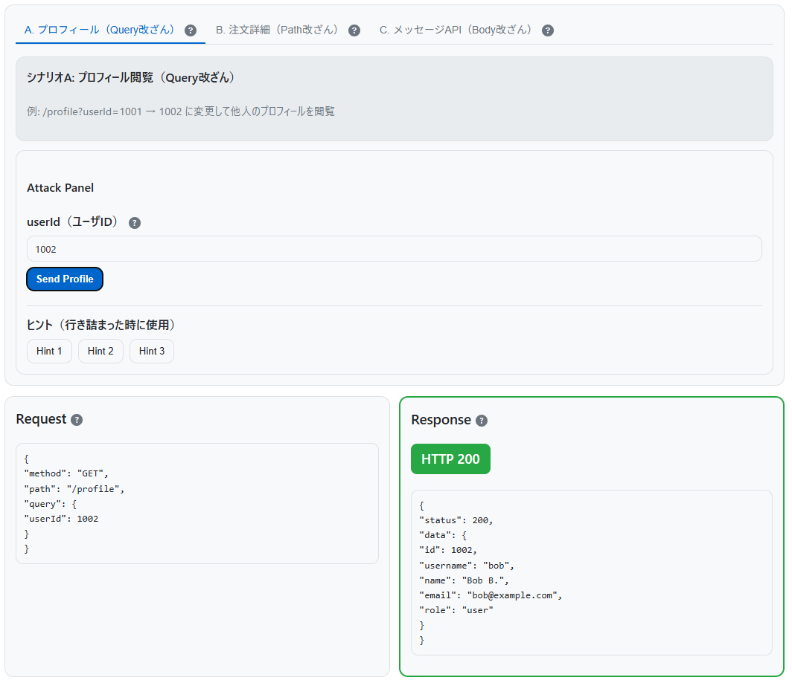

<!--
---
title: IDOR Clinic
category: web-security
difficulty: 2
description: Interactive, client-side simulator to learn IDOR (Insecure Direct Object Reference). Practice URL/Path/Body/Header tampering and compare VULN vs SECURE. No data stored or sent.
tags: [idor, access-control, authorization, insecure-direct-object-reference, education, simulator, web-security, visualization]
demo: https://ipusiron.github.io/idor-clinic/
---
-->

**Day065 - 生成AIで作るセキュリティツール100**

# IDOR Clinic - IDOR体験ツール

**IDOR Clinic** は、Webアプリの水平方向の権限昇格脆弱性 **IDOR (Insecure Direct Object Reference)** を体験できる、**クライアントサイド完結**のインタラクティブ・シミュレーターです。

脆弱挙動（**VULN**）と対策挙動（**SECURE**）をワンタッチで切り替え、**認証と認可は別物**であること、**所有者チェック**や**非推測ID**の重要性を視覚的に学べます。

> **学習目的の擬似環境**です。入力はブラウザー内で処理され、**保存・送信しません**（Networkタブにも外部送信は出ません）。

---

## 🌐 デモページ

👉 **[https://ipusiron.github.io/idor-clinic/](https://ipusiron.github.io/idor-clinic/)**

ブラウザーで直接お試しいただけます。

---

## 📸 スクリーンショット

>  
>*シナリオA（他人のプロフィール閲覧）の実験*

---

## 学習ゴール

1. **認証**（ログイン）と **認可**（アクセス制御）の違いを理解する  
2. **予測可能な識別子（連番ID、注文番号等）の危険性**を体感する  
3. **URL / Path / Body / Header** いずれでも識別子改ざんが起こり得ることを学ぶ  
4. **所有者検証・間接参照・非推測ID・レート制限・監査**などの対策を、VULN/SECUREで比較する

---

## クイックスタート（30秒）

1. ヘッダー右側で **VULN（脆弱）** を選択
2. ログイン選択から **alice (#1001)** など任意ユーザでログイン
3. **App** タブを開き、シナリオ（**A / B / C**）を選択
4. **Attack Panel** で ID を改ざんし **Send**
5. 成功したら **SECURE（対策）** に切り替え、**同じ操作がブロック**されることを確認

> すべてブラウザー内の擬似処理で動作します。サーバは不要です。

---

## シナリオ

### A. プロフィール閲覧（水平的 IDOR）
**攻撃手法**: URLパラメーター改ざんによる他人プロフィール閲覧
- **脆弱性**: 認証後でも、他人のユーザIDを指定することで情報が閲覧可能
- **原因**: サーバ側での所有者チェック不備

### B. 注文詳細取得（予測可能な識別子）
**攻撃手法**: URLパス改ざんによる他人注文情報取得
- **脆弱性**: 連番の注文IDを推測して他人の注文詳細にアクセス可能
- **原因**: 推測しやすいID設計と所有者照合の欠如

### C. メッセージ盗聴（API Body 改ざん）
**攻撃手法**: JSONリクエストボディ改ざんによる他人宛メッセージ閲覧
- **脆弱性**: メッセージIDを変更することで他人宛のメッセージを閲覧可能
- **原因**: 受信者チェックとアクセストークン検証の不備

---

## モード比較

| 項目 | **VULN**（脆弱） | **SECURE**（対策） |
|---|---|---|
| 所有者照合 | なし | `resource.ownerId === session.user.id` |
| 参照方法 | 直接参照（連番・推測可） | **間接参照**（`/me` や不可視トークン） |
| IDの性質 | `1001`, `ORD-000123` など推測容易 | ランダムトークン（長く衝突しにくい） |
| レート制限 | なし | 短時間の多回数アクセスを**ブロック/警告**（擬似） |
| 監査・検知 | なし | 多対象連続試行で**アラート表示**（擬似） |

---

## 本ツールの使い方

> 本ツールは学習用の **擬似環境** です。入力はブラウザー内で処理され、**保存・送信しません**。

### 基本操作

1. **モード選択**: ヘッダー右側で **VULN**（脆弱）/ **SECURE**（対策）を切り替え
2. **ログイン**: alice、bob、carolのいずれかを選択（IDも表示される）
3. **シナリオ選択**: 上部タブの **App** を開き、シナリオ A/B/C を選択
4. **Attack Panel**: 各シナリオでIDを改ざんして攻撃を実行
5. **結果確認**: Request/Responseパネルで成功/失敗を確認
6. **テーマ変更**: ヘッダー右端の☀️/🌙ボタンでライト/ダークモード切替

### Attack Panel 操作方法

#### A. プロフィール攻撃（URLパラメーター改ざん）
**操作**: `userId` フィールドに他人のID（1002、1003など）を入力 → **Send Profile**
- **VULN結果**: 他人プロフィールが表示される（200 OK、Score +100）
- **SECURE結果**: 403 Forbidden（所有者チェックで拒否）

#### B. 注文攻撃（URLパス改ざん）
**操作**: `orderId` フィールドの連番を変更（例：ORD-000101 → ORD-000102）→ **Send Order**
- **事前準備**: ログイン後にページを開き直す（候補リスト表示のため）
- **VULN結果**: 他人の注文詳細が表示される（200 OK、Score +100）
- **SECURE結果**: 404 Not Found（ランダムトークンのため推測不能）

#### C. メッセージ攻撃（JSONボディ改ざん）
**操作**: JSON内の `messageId` を変更（例：9001 → 9002）→ **Send Message**
- **事前確認**: `X-Access-Token` ヘッダーがログイン時に自動設定されていることを確認
- **VULN結果**: 他人宛メッセージが表示される（200 OK、Score +100）
- **SECURE結果**: 401/403エラー（トークン・受信者チェックで拒否）

### スコアリング・支援機能

- **スコア**: 攻撃成功 +100、ヒント使用 -30、検知発生 -50
- **ヒント**: 各シナリオに3段階のヒント（行き詰まり時に使用）
- **ログ**: 操作履歴をタイムライン表示（Resetでクリア可）
- **検知**: 短時間多数試行で疑似アラート発生

### 学習支援ページ

- **Compare**: VULN vs SECURE の対策比較表
- **Learn**: IDOR の詳細解説（アコーディオン形式4セクション）
- **Home**: ツール概要と学習ガイド

### トラブルシューティング

- **注文IDが空欄**: ログイン後にAppページを再読み込み
- **JSON エラー**: 有効なJSON形式で入力（カンマ・引用符に注意）
- **SECURE で404**: 正常動作（推測不能トークンのため）
- **直接アクセス404**: ハッシュルーティング使用（`/#/app`）

---

## 活用シナリオ例

### シナリオ1：セキュリティ学習（授業・自習）
- **目的**：認証と認可の違い、IDORの成立条件と対策（所有者照合・間接参照・非推測ID）を体感的に理解する
- **対象**：セキュリティ初学者〜中級者
- **手順**
  1. `Mode: VULN` で **A/B/C** を順に実施（他人データが閲覧できることを確認）
  2. `Mode: SECURE` に切替えて **同操作が失敗**（403/404/拒否）になることを比較
  3. `#/compare` で **VULN vs SECURE** の差分（表）を復習
  4. Attack Panel の **Query/Path/Body/Headers** を使い、識別子改ざんの入口を整理
- **成果物**：
  - 「どの層で何を防ぐか」チェックリスト（所有者照合・非推測ID・レート制限・監査）
  - 受講メモ（成功時スクリーンショット＋失敗時レスポンスの対比）

### シナリオ2：CTF／演習課題
- **目的**：IDORの発見→悪用→防御の一連の思考プロセスを短時間で練習する
- **対象**：CTF初級〜中級、社内ハンズオン
- **手順**
  1. 競技者は `Mode: VULN` で **A/B/C** のいずれか2つ以上を成功させる（Score加点が指標）
  2. 成功例：
     - A: `userId` を自分以外へ／B: `ORD-...` を+1／C: `messageId` を別番号
  3. 次に `Mode: SECURE` へ切替え、**同手順が失敗**する理由を説明（トークン化・所有者照合・ヘッダー検証）
  4. 任意の拡張課題：短時間に多数のIDを試し **疑似検知（Suspicious...）** を発生させる
- **採点例**：
  - IDOR成功（各+100）、ヒント使用（-30）、検知発生（-50）
  - 成功スクリーンショット＋ログ提出で完了

### シナリオ3：開発チームの設計レビュー／DevSecOpsオンボーディング
- **目的**：要件定義やコードレビューに落とすための「**悪い例→良い例**」の共通認識を作る
- **対象**：バックエンド／フロントエンド開発者、QA、プロダクト担当
- **手順**
  1. `Mode: VULN` で **直接参照**の危険を確認（A/B/C いずれか1つで可）
  2. `Mode: SECURE` に切替えて、**対策の設計要素**を洗い出す
     - 所有者照合（サーバ側）／不可視参照（`/me`・トークン）／非推測ID／レート制限／監査ログ
  3. 自社APIのエンドポイントに当てはめ、**受け入れ基準**を文章化
     - 例：「`/orders/:id` は ownerId と session.user.id が一致しない場合 403」
  4. 回帰テスト観点として **VULN→SECURE** の差分をQAチェックリスト化
- **成果物**：
  - 「アクセス制御の受け入れ基準」テンプレ
  - レビュー時の観点リスト（直接参照禁止・トークン長・エラーメッセージ内容・レート制限閾値 など）

---

## アーキテクチャー

本ツールはクライアントサイド完結のSPA（Single Page Application）として設計されています。

- **フロントエンド**: Vanilla JavaScript（フレームワーク不使用）
- **ルーティング**: ハッシュベースルーティング（GitHub Pages対応）
- **データ**: JSON ファイルベースの疑似DB
- **API**: モード切替によるシミュレーション機能

---

## 🔧 開発者向け情報

**技術的な実装詳細については、開発者向け技術文書をご覧ください：**

📋 **[DEVELOPMENT.md](DEVELOPMENT.md)** - 技術仕様・アーキテクチャー詳細

- カスタムUIフレームワーク `U.el()` の実装
- ページ生成システムとルーティング
- モード切替・認証・スコアリング機構
- テーマシステムとコンポーネント設計
- セキュリティ考慮事項と最適化手法

---

## 免責 / 倫理

- 本ツールは **教育・学習目的** の擬似環境です。**実在サービスへの攻撃は厳禁** です。
- 入力はブラウザー内で処理され、**保存・送信しません**。
- 表示されるデータはすべて **ダミー** です。

---

## 📄 ライセンス

MIT License – 詳細は [LICENSE](LICENSE) を参照してください。

---

## 🛠 このツールについて

本ツールは、「生成AIで作るセキュリティツール100」プロジェクトの一環として開発されました。 
このプロジェクトでは、AIの支援を活用しながら、セキュリティに関連するさまざまなツールを100日間にわたり制作・公開していく取り組みを行っています。

プロジェクトの詳細や他のツールについては、以下のページをご覧ください。  

🔗 [https://akademeia.info/?page_id=42163](https://akademeia.info/?page_id=42163)
