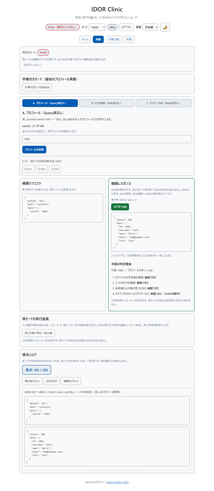
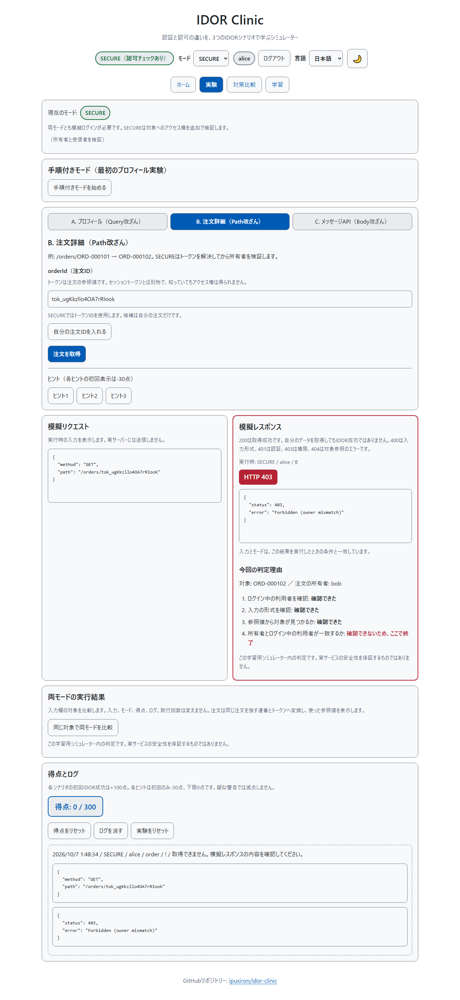
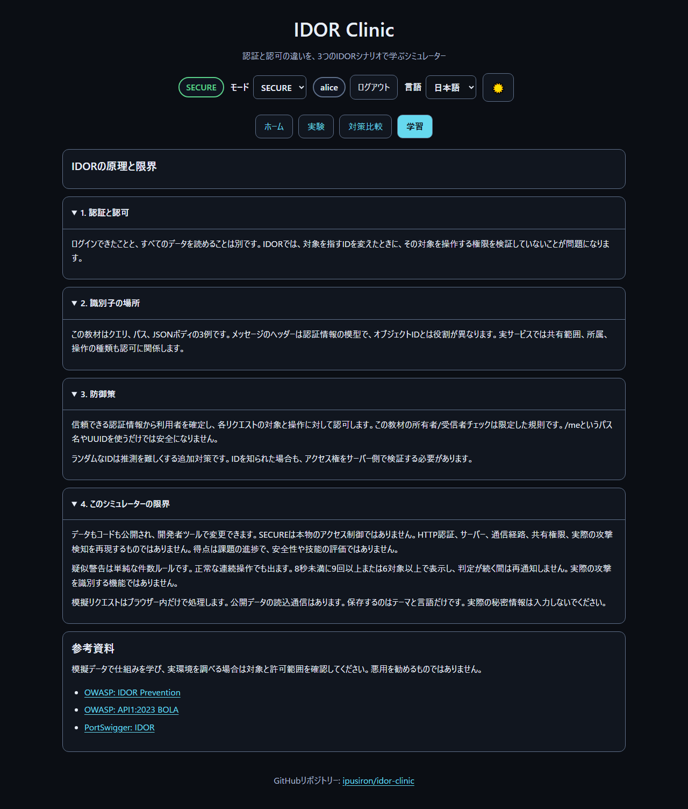
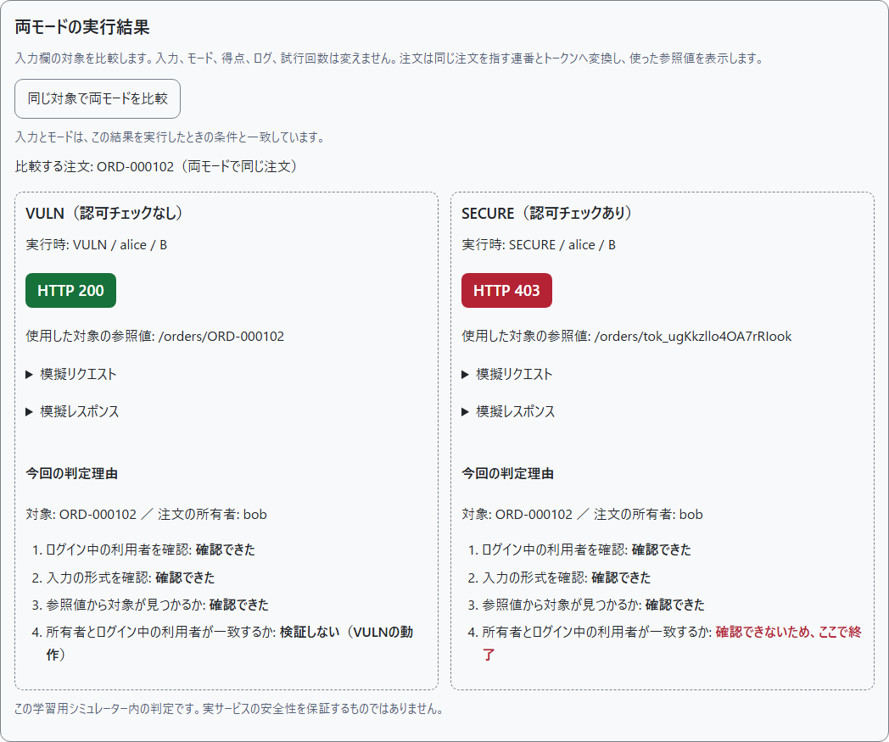

<!--
---
id: day065
slug: idor-clinic

title: "IDOR Clinic"

subtitle_ja: "IDOR体験ツール"
subtitle_en: "Interactive IDOR Learning Simulator"

description_ja: "学習用のダミーデータで、認証とオブジェクト単位の認可の違いを学ぶブラウザー内シミュレーター。手順付きの実験、判定理由の段階表示、同じ対象のVULNとSECUREの比較で、所有者検証と参照値の役割を確認できます。"
description_en: "Browser-only simulator using dummy data to teach authentication and object-level authorization. Guided experiments, step-by-step decisions and VULN/SECURE comparisons for the same object explain ownership checks and object references."

category_ja:
  - Webセキュリティ
category_en:
  - Web Security

difficulty: 3

tags:
  - idor
  - access-control
  - authorization
  - insecure-direct-object-reference
  - education
  - simulator
  - web-security
  - visualization

repo_url: "https://github.com/ipusiron/idor-clinic"
demo_url: "https://ipusiron.github.io/idor-clinic/"

hub: true
---
-->

# IDOR Clinic - IDOR体験ツール


[](https://ipusiron.github.io/idor-clinic/)

**Day065 - 生成AIで作るセキュリティツール100**

[English](README.en.md) · 日本語

IDOR Clinicは、対象のIDを変更したときにアクセス権の検証が抜ける問題（IDOR）を学ぶ、ブラウザー内のシミュレーターです。
学習用のダミーデータを使い、VULN（認可チェックなし）とSECURE（認可チェックあり）の応答を比較します。
プロフィール、注文、メッセージは学習用に作った例で、実在の人物や取引の記録ではありません。

SECUREも学習用の模型であり、本物のアクセス制御ではありません。
ランダムなIDは推測を難しくする追加対策で、対象ごとの認可の代わりにはなりません。

---

## 🌐 デモページ

[IDOR Clinicを開く](https://ipusiron.github.io/idor-clinic/?lang=ja)

インストールは不要です。
言語は「URLの`?lang=ja|en`、保存した設定、ブラウザーの言語」の順で決まります。
日本語以外のブラウザーでは英語を使用します。

## 📸 スクリーンショット



*日本語、ライトテーマ。AliceがBobのプロフィールを取得した例。*



*日本語、ライトテーマ。有効な注文トークンを知っていても、所有者が違えば403。*



*日本語、ダークテーマ。学習ページの解説。*



*日本語、ライトテーマ。同じ注文を連番とトークンで参照し、所有者チェックの違いを比較。*

## 🎯 学習ゴール

- ログインによる認証と、対象への操作を許可する認可の区別
- クエリ、パス、JSONボディにあるオブジェクト参照の確認
- ランダムなIDと所有者検証の役割の区別
- 正常な取得、認証エラー、認可エラー、未解決の参照の比較

この教材の認可は「プロフィールは本人、注文は所有者、メッセージは受信者」に限定しています。
実サービスでは、共有範囲、所属、操作の種類などを含む権限設計が必要です。
ヘッダーのセッショントークンは認証情報の模型であり、オブジェクトIDとは役割が異なります。

## 🚀 クイックスタート

1. モードをVULNにして、`alice (#1001)`で模擬ログイン
2. 「実験」からシナリオAを選択
3. `userId`に`1002`を入力して「プロフィールを取得」
4. Bobのデータが200で返ることを確認
5. SECUREに切り替え、同じ入力で再実行して403を確認

モードを変えても入力と直前の結果は残ります。
表示は最後に実行した結果なので、実行時のモードと利用者を確認し、比較するときは再実行してください。

## 🧑‍🏫 手順と判定理由

### 最初のプロフィール実験

「実験」で「手順付きモードを始める」を押すと、自分の取得、他人の取得、SECUREでの拒否を順に案内します。
ログイン中の利用者に合わせて例を選びます。
「例の条件を入力」は入力欄とモードだけを設定し、取得は実行しません。
「プロフィールを取得」を押し、案内した条件で期待する結果になったときだけ次の手順へ進みます。
「自由実験に戻る」で案内を閉じても入力と結果は残ります。

### 今回の判定理由

通常実行の結果には、ログイン、入力形式、対象の検索、本人または所有者や受信者の検証を順に表示します。
メッセージではセッショントークンの検証も表示します。
確認できなかった段階で終了し、それ以降は「未実施」と示します。
VULNで意図的に省略する検証は「検証しない」と表示し、途中終了とは区別します。
不正JSONや不正ヘッダーは、APIの判定より前の入力検証で止まります。

### 同じ対象で両モードを比較

「同じ対象で両モードを比較」は、現在の入力に対するVULNとSECUREの応答と判定理由を並べます。
入力、モード、得点、達成状況、ログ、試行回数は変更しません。
手順付きモードの進捗も進めません。

注文は現在のモードで入力の参照値を解決し、同じ注文を指す連番とトークンをそれぞれ使います。
同じ文字列をそのまま両方へ送る操作とは異なり、使用した参照値を表示します。
現在のモードで注文を特定できない場合は比較できません。
メッセージのヘッダーは入力どおりに使い、不正な認証情報を自動修正しません。

### 入力変更とヒント

入力またはモードが結果の実行時と違うときは「変更後は未実行」と表示します。
元の条件へ戻すと一致状態に戻ります。
通常結果と比較結果は別々に管理し、一方を実行しても他方の条件を更新しません。

開いたヒントは入力欄の近くに残り、ページや言語を切り替えても読み返せます。
ログイン変更、得点リセット、実験リセットで表示を消します。
ログイン変更だけではヒントの使用履歴を消さず、同じヒントを再度開いても重複して減点しません。

## 🧪 3つのシナリオ

### A. プロフィールのクエリ改ざん

`GET /profile?userId=1002`の対象IDを変えます。
VULNはログイン済みの他人にもプロフィールを返し、SECUREは要求したIDと本人のIDを照合します。
自分のデータが200で返ること自体はIDOR成功ではありません。

### B. 注文のパス改ざん

VULNでは`ORD-000101`などの連番IDを使います。
SECUREでは起動ごとに生成する`tok_...`形式の注文トークンを参照値に使い、解決後に所有者を検証します。
「自分の注文IDを入れる」で、現在のモードに合う自分の注文IDを入力できます。

他人の有効なトークンでも403になります。
この点を試す場合は、SECUREでBobにログインして自分の注文IDを控え、再読み込みせずAliceへログインし直して、そのIDを入力します。
注文トークンは注文の参照値で、ログインごとに変わるセッショントークンとは別物です。

### C. メッセージのJSONボディ改ざん

`POST /api/messages/view`のボディに`{"messageId":9002}`を指定します。
ボディは`messageId`だけを持つオブジェクトで、値は正の安全な整数です。
`null`、配列、文字列のID、余分なキー、不正JSONは400になります。

SECUREでは、現在の`X-Access-Token`と受信者を検証します。
ヘッダー名の大文字小文字は区別しません。
ヘッダーは1行で、ボディは4,096文字、ヘッダーは256文字、注文IDは128文字までです。

### 応答の例

次の表はAlice（1001）でログインした場合です。
Cの「有効なトークン」は現在のセッショントークンを指します。

| 操作 | VULN | SECURE |
|---|---|---|
| A: 自分の1001 | 200 | 200 |
| A: 他人の1002 | 200 | 403 |
| B: 自分の連番ORD-000101 | 200 | 404 |
| B: 他人の連番ORD-000102 | 200 | 404 |
| B: 自分の有効な注文トークン | 404 | 200 |
| B: 他人の有効な注文トークン | 404 | 403 |
| C: 自分宛9001、有効なトークン | 200 | 200 |
| C: 他人宛9002、有効なトークン | 200 | 403 |
| C: 自分宛9001、トークンなし | 200 | 401 |
| C: 不正なボディ | 400 | 400 |

両モードとも模擬ログインが必要で、未ログインで模擬APIを呼ぶと401になります。
404は参照先が見つからないことを示し、認可の正しさやIDの推測不可能性の証明にはなりません。

## ⚖️ モード比較

| 項目 | VULN | SECURE |
|---|---|---|
| 模擬ログイン | 必要 | 必要 |
| 対象の認可 | 検証なし | 本人、所有者、受信者を検証 |
| プロフィールとメッセージのID | 数値ID | 同じ数値ID |
| 注文のID | 連番ID | ランダムトークン |
| メッセージのセッショントークン | 検証なし | 現在のトークンを検証 |
| レート制限 | 実装なし | 実装なし |
| 疑似警告 | 件数ルールで表示 | 同じ件数ルールで表示 |

`/me`というパス名やUUIDだけで安全になるわけではありません。
信頼できる認証情報から利用者を確定し、リクエストごとに対象と操作を認可する必要があります。

## 📖 得点と状態の扱い

得点は課題の進捗で、安全性や技能の評価ではありません。

- 各シナリオの初回IDOR成功：+100点、3シナリオで最大300点
- 同じシナリオの反復成功：対象や利用者を変えても追加点なし
- 各シナリオの各ヒント：初回のみ-30点、下限0点
- 疑似警告：遮断も減点もなし
- ログ：最大60件保持し、最新12件を表示

疑似警告は8秒未満の窓で9回以上の試行、または6対象以上への試行があると表示します。
対象はシナリオとIDの組で数えます。
同じ警告条件が続く間は再通知せず、条件が外れてから再び成立したときに通知します。
正常な連続操作でも出る単純な件数ルールであり、実際の攻撃検知ではありません。

| 操作 | 変わる状態 |
|---|---|
| モード、画面、言語の変更 | 入力、選択シナリオ、実行結果、得点、ログを保持 |
| ログイン、ログアウト | 入力と結果を初期化、試行履歴を消去。得点とログは保持 |
| 得点をリセット | 得点、達成状況、ヒント使用状況を初期化 |
| ログを消す | ログだけを消去 |
| 実験をリセット | 入力、結果、得点、達成状況、ヒント、ログ、試行履歴を初期化。利用者、モード、シナリオは保持 |
| ページの再読み込み | 模擬セッションと実験の状態を破棄し、注文トークンを再生成 |

比較結果も、モード、画面、言語の変更では保持し、ログイン変更と実験リセットで消します。
手順付きモードの進捗はログイン変更と実験リセットで最初に戻ります。
案内の表示と非表示は保持します。

## 🧭 画面と操作

- ホーム：概要、限界、実験の手順
- 実験：3シナリオ、手順案内、入力、判定理由、両モードの実行結果比較、得点とログ
- 対策比較：実装している認可と参照方法の比較
- 学習：認証と認可、識別子の場所、防御、限界の4項目と参考資料

言語とテーマはヘッダーで切り替えます。
テーマは保存した設定を優先し、未設定ならOSの明暗設定に合わせ、描画前に適用します。
シナリオタブは左右矢印、Home、Endでも移動できます。
説明はホバー操作なしで読め、学習項目はEnterまたはSpaceで開閉できます。

## 🔒 保存と通信と限界

模擬リクエスト、入力、ログ、得点、セッションはメモリー内だけで扱います。
実APIサーバーへ攻撃リクエストを送る機能はありません。
テーマと言語だけをlocalStorageに保存し、保存を拒否された場合も当該ページ内で操作を続けられます。

公開ページを開くと、HTML、JavaScript、CSS、画像、および同一サイトの公開JSONを取得します。
JSONの取得失敗、不正データ、5秒のタイムアウトでは内蔵の同じダミーデータを使います。
`file://`で開いた場合はJSONを取得せず、内蔵データを使います。
参考リンクを開くと、そのリンク先へ移動します。

データは3ユーザー（alice、bob、carol）、6注文、5メッセージで、すべて公開された学習用のダミーデータです。
開発者ツールでコードも状態も変更できるため、SECUREは本物のセキュリティ境界ではありません。
実HTTP認証、サーバー、通信経路、共有権限、実際の攻撃検知は再現していません。
秘密情報や実際の認証情報を入力しないでください。

## 🎓 活用例

このツールならではの使い方

- 他人の対象に届いたときだけ成功になることを確かめる（IDORの定義の授業）：VULNモードで、注文の持ち主が自分（利用者1）でない相手（持ち主2）の応答が200で返ると、この課題は成功になり、得点が100入る。同じ200でも、持ち主が自分（持ち主1）の応答では成功にならない。自分の対象を見るのは正規のアクセスで、他人の対象に届いて初めてIDORだという定義を、成否と得点で確かめられる
- 認可を直すと同じ操作が成功しなくなることを確かめる（脆弱と対策の比較）：VULNモードで成功した他人の注文への操作を、SECUREモードで同じように行っても成功にならない。応答が403で拒否されれば、持ち主が他人でも得点は入らない。認可の確認を入れるという1つの対策で、さっきの攻撃がそのまま拒否に変わることを、モードを切り替えて確かめられる
- 認証トークンと認可は別だと確かめる（認証と認可の授業）：ヘッダーの解釈は、`X-Access-Token`がちょうど1つで文字列のときだけトークンとして取り出す。同じ名前のヘッダーが2つあると、どちらを信じるか決められないので取り出さない。正しいトークンで「誰か」が分かっても、その人が「その対象を見てよいか」は別の確認であり、IDORはトークンが正しくても起きる認可の失敗だと示せる

- 授業と自習：自分と他人の対象で応答を比較し、認証と認可の違いを説明
- CTF入門と社内演習：VULNで成功した操作をSECUREで再実行し、拒否の理由を記録
- 設計レビュー：所有者限定という教材の規則と、自社の共有範囲や操作権限の違いを整理

得点や警告を本物の診断結果として扱わず、実環境を調べる場合は対象と許可範囲を確認してください。

## ❓ トラブルシューティング

- SECUREの注文で404：「自分の注文IDを入れる」を使用。連番IDや再読み込み前のトークンでは参照できない
- メッセージで400：`{"messageId":9001}`のように数値だけを指定し、余分なキーや改行付きヘッダーを除去
- メッセージで401：現在の模擬ログインとセッショントークンを確認
- 結果が変わらない：モード変更や入力変更後に再実行。実行時の表示を確認
- 保存できない旨の表示：テーマと言語は当該ページ内のみ。実験は続行可能
- 初期化エラー：Web Cryptoの安全な乱数を利用できるブラウザーで開く

## 🔧 開発と検証

依存ライブラリーもビルド工程もありません。
`index.html`を直接開くか、リポジトリールートでHTTPサーバーを起動します。

```sh
python -m http.server 8000
```

Node.js 22以上で、追加インストールなしに自動テストを実行できます。

```sh
npm test
```

認可の組合せ、判定過程、比較の副作用、入力変更、手順の進行、得点、警告、言語設定、CSP、配色、文書の整合性を検証します。
GitHub Actionsはpushとpull_requestで同じテストを実行します。
実装の責務と手動確認項目は[DEVELOPMENT.md](DEVELOPMENT.md)を参照してください。

## 🔗 参考資料

- [OWASP IDOR Prevention Cheat Sheet](https://cheatsheetseries.owasp.org/cheatsheets/Insecure_Direct_Object_Reference_Prevention_Cheat_Sheet.html)
- [OWASP API1:2023 Broken Object Level Authorization](https://api-security.owasp.org/editions/2023/en/0xa1-broken-object-level-authorization/)
- [PortSwigger IDOR](https://portswigger.net/web-security/access-control/idor)

## 📁 ディレクトリー構造

```text
idor-clinic/
├── .github/workflows/test.yml  # Node.jsの自動テスト
├── assets/                    # 日本語の画面画像
│   ├── screenshot.png
│   ├── screenshot2.png
│   ├── screenshot3.png
│   ├── screenshot4.png
│   └── en/                    # 対応する英語の画面画像
│       ├── screenshot.png
│       ├── screenshot2.png
│       ├── screenshot3.png
│       └── screenshot4.png
├── data/                      # 公開された学習用のダミーデータ
│   ├── users.json
│   ├── orders.json
│   └── messages.json
├── js/
│   ├── preferences.js         # 描画前のテーマと言語
│   ├── core.js                # 入力検証と得点と警告
│   ├── utils.js               # 安全なDOM生成と乱数
│   ├── data.js                # データ取得とフォールバック
│   ├── auth.js                # 模擬セッション
│   ├── api.js                 # 模擬APIと認可
│   ├── messages.js            # 日英辞書
│   ├── i18n.js                # 翻訳と切り替え
│   ├── ui.js                  # 画面と実験状態
│   └── main.js                # 起動処理
├── test/                      # Node.js標準のテスト
├── index.html                 # HTMLとCSP
├── style.css                  # レイアウトとテーマ
├── favicon.ico                # サイトアイコン
├── package.json               # テスト実行設定
├── README.md                  # 日本語の説明
├── README.en.md               # 英語の説明
├── DEVELOPMENT.md             # 開発用の仕様と確認項目
├── CLAUDE.md                  # リポジトリーの作業規則
└── LICENSE                    # MITライセンス
```

## 💻 動作環境

Web Crypto、localStorage、標準のDOM APIを備えたモダンブラウザーを対象にしています。
localStorageは利用できなくても動作します。
検証範囲と未検証の環境は[開発文書](DEVELOPMENT.md)に記載しています。

## 📄 ライセンス

MIT License。詳細は[LICENSE](LICENSE)を参照してください。
アプリ本体に外部依存ライブラリーはありません。

## 🛠️ このツールについて

本ツールは、「生成AIで作るセキュリティツール100」プロジェクトの一環として開発されました。
このプロジェクトでは、AIの支援を活用しながら、セキュリティに関連するさまざまなツールを100日間にわたり制作、公開していく取り組みを行っています。

プロジェクトの詳細や他のツールについては、以下のページをご覧ください。

[生成AIで作るセキュリティツール100](https://akademeia.info/?page_id=42163)
